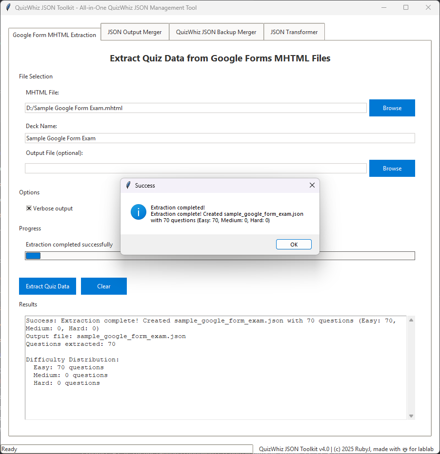
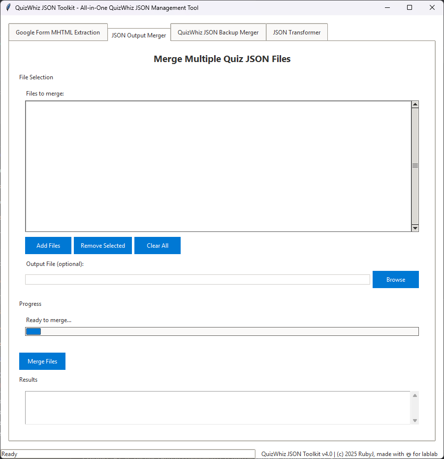
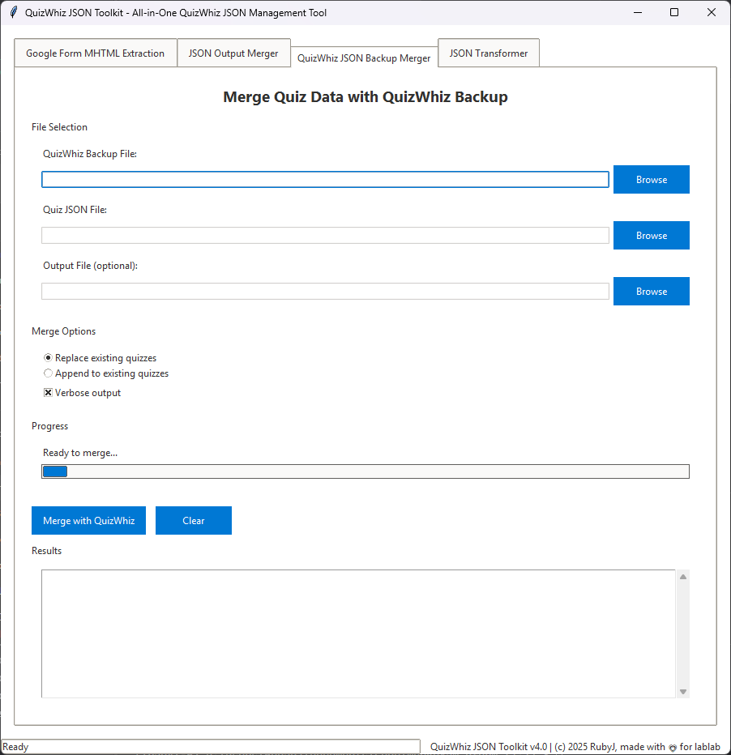
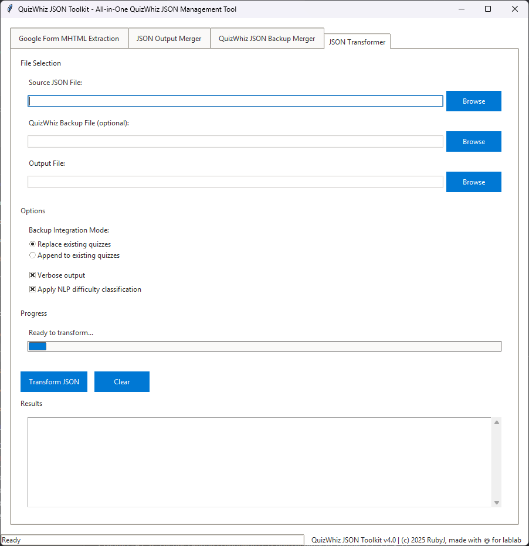
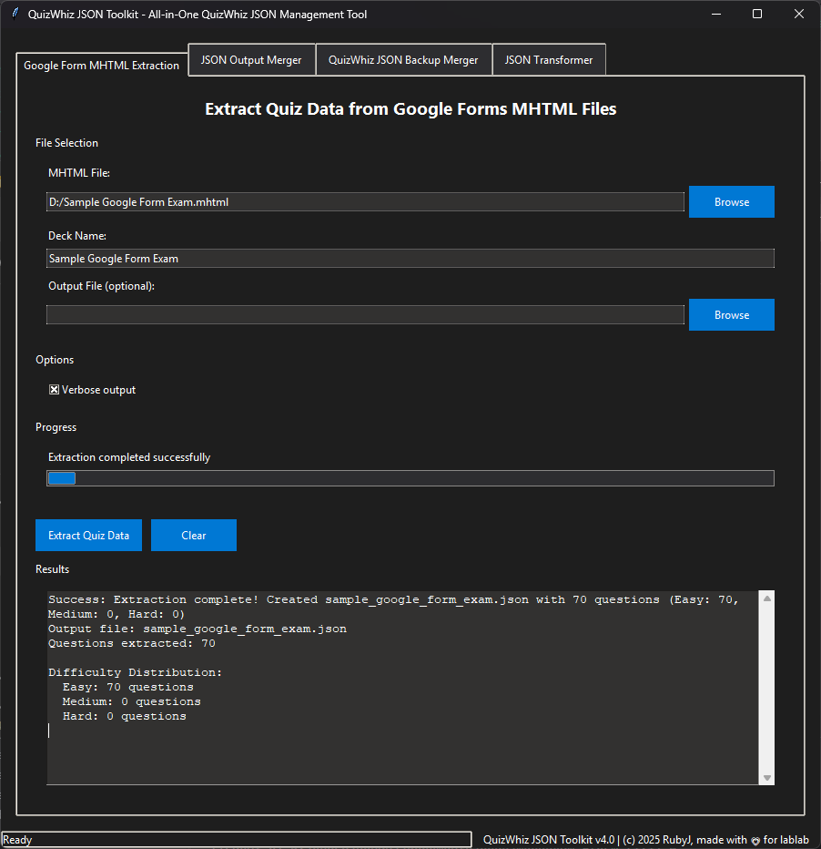

<!-- Improved compatibility of back to top link: See: https://github.com/othneildrew/Best-README-Template/pull/73 -->
<a name="readme-top"></a>

<!-- PROJECT SHIELDS -->
[![Version][version-shield]][version-url]
[![License][license-shield]][license-url]
[![Python][python-shield]][python-url]
[![Platform][platform-shield]][platform-url]
[![Issues][issues-shield]][issues-url]

<!-- PROJECT LOGO -->
<br />
<div align="center">
  <a href="https://github.com/rjmolina13/quizwhiz-json-toolkit">
    <h1>🎯 QuizWhiz JSON Toolkit</h1>
  </a>

## <div style="text-align: center">QuizWhiz JSON Toolkit <span style="font-size: 0.7em; font-style: italic">*v4.1*</span></div>

<div align="center">
  <p>
    QuizWhiz JSON Toolkit: A comprehensive solution for extracting, merging, and managing quiz data from Google Forms with advanced difficulty analysis and intelligent NLP-based scoring.
    <br />
    <br />
    <a href="https://github.com/rjmolina13/quizwhiz-json-toolkit">View Demo</a>
    ·
    <a href="https://github.com/rjmolina13/quizwhiz-json-toolkit/issues">Report Bug</a>
    ·
    <a href="https://github.com/rjmolina13/quizwhiz-json-toolkit/issues">Request Feature</a>
  </p>
</div>

</div>


<!-- TABLE OF CONTENTS -->
<details>
  <summary>Table of Contents</summary>
  <ol>
    <li>
      <a href="#about-the-project">About The Project</a>
      <ul>
        <li><a href="#built-with">Built With</a></li>
      </ul>
    </li>
    <li>
      <a href="#getting-started">Getting Started</a>
      <ul>
        <li><a href="#download-executable-recommended">Download Executable</a></li>
        <li><a href="#install-from-source">Install from Source</a></li>
      </ul>
    </li>
    <li><a href="#usage">Usage</a></li>
    <li><a href="#advanced-features">Advanced Features</a></li>
    <li><a href="#development">Development</a></li>
        <li><a href="#screenshots">Screenshots</a></li>
        <li><a href="#screenshots">Screenshots</a></li>
        <li><a href="#screenshots">Screenshots</a></li>
    <li><a href="#contributing">Contributing</a></li>
    <li><a href="#license">License</a></li>
    <li><a href="#contact">Contact</a></li>
    <li><a href="#acknowledgments">Acknowledgments</a></li>
  </ol>
</details>


<!-- ABOUT THE PROJECT -->
## About The Project

***QuizWhiz JSON Toolkit*** is a comprehensive solution for extracting, merging, and managing quiz data from Google Forms with advanced difficulty analysis and intelligent NLP-based scoring.

This toolkit simplifies the process of managing quiz data by automating extraction from MHTML files, providing sophisticated difficulty analysis using Bloom's Taxonomy, and offering seamless JSON management capabilities. You no longer have to manually process quiz data or worry about duplicate detection and merging conflicts.

***QuizWhiz JSON Toolkit*** will scan your files, extract quiz data with proper formatting, analyze difficulty levels using advanced NLP techniques, and merge multiple datasets while preserving data integrity.

<p align="right">(<a href="#readme-top">back to top</a>)</p>

### Built With

* [![Python][Python]][Python-url]
* [![Tkinter][Tkinter]][Tkinter-url]
* [![Love][Love]][Love-url]


<p align="right">(<a href="#readme-top">back to top</a>)</p>


<!-- GETTING STARTED -->
## Getting Started

To use QuizWhiz JSON Toolkit, you can either download the pre-built executable or install from source. Follow the prerequisites and instructions below.

### ✨ Key Features

#### 🔄 **MHTML Extraction**
- Extract quiz data from Google Forms MHTML files
- Advanced question parsing with context preservation
- Support for multiple choice, multiple select, and text questions
- Automatic option detection and formatting

#### 🧠 **Intelligent Difficulty Analysis**
- **Enhanced NLP-based difficulty scoring** using Bloom's Taxonomy
- **LET (Licensure Examination for Teachers) pattern recognition**
- Cognitive complexity analysis (Remember → Create)
- Domain-specific complexity detection
- Linguistic complexity assessment

#### 📊 **JSON Management**
- Merge multiple quiz JSON files with duplicate detection
- Integrate with QuizWhiz backup files
- Smart conflict resolution
- Preserve metadata and formatting

#### 🎨 **Modern GUI Interface**
- **Dark mode support** with adaptive theming
- Tabbed interface for different operations
- Real-time progress tracking
- Comprehensive error handling and logging

#### 🖥️ **Cross-Platform Support**
- Windows, macOS, and Linux compatibility
- Standalone executables available
- Command-line interface for automation

<p align="right">(<a href="#readme-top">back to top</a>)</p>

1. Clone the QuizWhiz JSON Toolkit repository to your local machine or [download the latest release](https://github.com/rjmolina13/quizwhiz-json-toolkit/releases).
2. For executable version: Download the appropriate executable for your operating system:
   - **Windows**: `QuizWhiz-Toolkit_v4.1_Windows.exe`
   - **macOS**: `QuizWhiz-Toolkit_v4.1_macOS`
   - **Linux**: `QuizWhiz-Toolkit_v4.1_Linux`
3. For source installation: Ensure you have Python 3.7+ installed on your system.
4. Install required dependencies:

```bash
# Clone the repository
git clone https://github.com/rjmolina13/quizwhiz-json-toolkit.git
cd quizwhiz-json-toolkit

# Install dependencies
pip install -r requirements.txt
```

5. Double-click on the executable or run the Python script:

```bash
# For executable (no Python required)
./QuizWhiz-Toolkit_v4.1_Windows.exe  # Windows
./QuizWhiz-Toolkit_v4.1_macOS        # macOS
./QuizWhiz-Toolkit_v4.1_Linux        # Linux

# For source code
python quiz_toolkit.py
```

6. The application will launch with a modern GUI interface.
7. Choose your operation from the tabbed interface:
   - **Extract**: Process MHTML files from Google Forms
   - **Merge**: Combine multiple JSON quiz files
   - **Analysis**: View difficulty analysis results
8. Select your input files and output destination.
9. Click "Process" and wait for completion. *(The application will show progress and play a notification sound when finished.)*
10. Review the results and generated files in your specified output directory.

<p align="right">(<a href="#readme-top">back to top</a>)</p>

<!-- USAGE -->
## Usage

### GUI Mode (Default)

Simply run the application to open the graphical interface:

```bash
python quiz_toolkit.py
```

### Command Line Mode

#### Extract from MHTML
```bash
python quiz_toolkit.py extract input.mhtml -o output.json
```

#### Merge JSON files
```bash
python quiz_toolkit.py merge file1.json file2.json -o merged.json
```

#### Merge with QuizWhiz backup
```bash
python quiz_toolkit.py merge-quizwhiz backup.json new_data.json -o updated.json
```

<p align="right">(<a href="#readme-top">back to top</a>)</p>

<!-- ADVANCED FEATURES -->
## Advanced Features

### Difficulty Analysis Engine

The toolkit includes a sophisticated difficulty analysis system trained on LET examination patterns:

- **Cognitive Complexity**: Analyzes questions using Bloom's Taxonomy levels
- **Question Structure**: Identifies factual, comparative, conditional, and application-based questions
- **Domain Expertise**: Recognizes educational theory, scientific principles, and research methodology
- **Linguistic Complexity**: Evaluates sentence structure and technical vocabulary

### Smart Duplicate Detection

- **Fuzzy matching** for similar questions
- **Semantic similarity** analysis
- **Option-based comparison** for multiple choice questions
- **Configurable similarity thresholds**

### Theme System

- **Automatic dark/light mode detection** (Windows)
- **Manual theme switching**
- **Consistent styling** across all UI elements
- **High contrast support**

<p align="right">(<a href="#readme-top">back to top</a>)</p>

<!-- DEVELOPMENT -->
## Development

### Prerequisites

- Python 3.7 or higher
- tkinter (usually included with Python)
- Required packages listed in `requirements.txt`

### Setting up Development Environment

```bash
# Clone the repository
git clone https://github.com/rjmolina13/quizwhiz-json-toolkit.git
cd quizwhiz-json-toolkit

# Create virtual environment
python -m venv venv
source venv/bin/activate  # On Windows: venv\Scripts\activate

# Install dependencies
pip install -r requirements.txt

# Run in development mode
python quiz_toolkit.py
```

### Building Executables

```bash
# Install build dependencies
python -m pip install --upgrade pip
pip install pyinstaller
pip install -r requirements.txt

# Build executable with version (replace 4.1 with current version)
pyinstaller --onefile --windowed --name="QuizWhiz-Toolkit_v4.1" quiz_toolkit.py

# The executable will be created in the dist/ directory
# For platform-specific naming:
# Windows: QuizWhiz-Toolkit_v4.1_Windows.exe
# macOS: QuizWhiz-Toolkit_v4.1_macOS
# Linux: QuizWhiz-Toolkit_v4.1_Linux
```

### Automated Builds

The project includes GitHub Actions workflow for automated building:

- **Automatic version detection** from `quiz_toolkit.py` line 18
- **Multi-platform builds** (Windows, macOS, Linux)
- **Automatic releases** when version changes on main branch
- **SHA256 checksums** generated for all executables

Builds are triggered on:
- Push to main/master branch
- Pull requests
- Manual workflow dispatch

<p align="right">(<a href="#readme-top">back to top</a>)</p>

## Project Structure

```
quizwhiz-json-toolkit/
├── .github/
│   └── workflows/
│       └── build-release.yml # CI/CD workflow
├── .gitignore              # Git ignore rules
├── CHANGELOG.md            # Version history
├── LICENSE                 # MIT License
├── README.md               # This file
├── debug_option_filtering.py # Debug utilities
├── debug_physics_session3.py # Debug utilities
├── docs/
│   └── screenshots/        # Application screenshots
├── quiz_toolkit.py         # Main application file
└── requirements.txt        # Python dependencies
```

[⬆️ Back to top](#quizwhiz-json-toolkit)

<!-- CONTRIBUTING -->

### Google Form MHTML Extraction

*Google Form MHTML extraction interface for processing Google Forms files*

### JSON Output Merger

*JSON Output Merger interface for combining multiple quiz files*

### QuizWhiz JSON Backup Merger

*QuizWhiz JSON Backup Merger interface for integrating with QuizWhiz backups*

### JSON Transformer

*JSON Transformer interface for advanced JSON structure transformation*

### Dark Mode

*Dark mode interface for comfortable usage*

<p align="right">(<a href="#readme-top">back to top</a>)</p>


<!-- SCREENSHOTS -->
## Screenshots

### Dark Mode Interface


*Main interface showcasing the dark mode theme with modern styling*

### Google Form MHTML Extraction Tab


*"Google Form MHTML Extraction" tab showing successful extraction with dialog notification*

### JSON Output Merger Tab


*"JSON Output Merger" tab for combining multiple quiz JSON files*

### JSON Transformer Tab


*"JSON Transformer" tab for advanced JSON structure transformation and processing*

### QuizWhiz JSON Backup Merger Tab


*"QuizWhiz JSON Backup Merger" tab for integrating with existing QuizWhiz backup files*

<p align="right">(<a href="#readme-top">back to top</a>)</p>

<!-- CONTRIBUTING -->
## Contributing

Contributions are what make the open source community such an amazing place to learn, inspire, and create. Any contributions you make are **greatly appreciated**.

If you have a suggestion that would make this better, please fork the repo and create a pull request. You can also simply open an issue with the tag "enhancement".
Don't forget to give the project a star! Thanks again!

1. Fork the Project
2. Create your Feature Branch (`git checkout -b feature/AmazingFeature`)
3. Commit your Changes (`git commit -m 'Add some AmazingFeature'`)
4. Push to the Branch (`git push origin feature/AmazingFeature`)
5. Open a Pull Request

### Development Guidelines

1. **Code Style**: Follow PEP 8 guidelines
2. **Testing**: Test your changes thoroughly
3. **Documentation**: Update README and docstrings as needed
4. **Commits**: Use clear, descriptive commit messages

<p align="right">(<a href="#readme-top">back to top</a>)</p>

<!-- REQUIREMENTS -->
## Requirements

- Python 3.7+
- tkinter (GUI framework)
- Standard library modules (json, re, datetime, etc.)

<p align="right">(<a href="#readme-top">back to top</a>)</p>

<!-- KNOWN ISSUES -->
## Known Issues

- Large MHTML files (>50MB) may take longer to process
- Some complex Google Forms layouts might require manual review
- Dark mode detection requires Windows 10 version 1903 or later

<p align="right">(<a href="#readme-top">back to top</a>)</p>

<!-- CHANGELOG -->
## Changelog

See [CHANGELOG.md](CHANGELOG.md) for a detailed history of changes.

<p align="right">(<a href="#readme-top">back to top</a>)</p>

<!-- LICENSE -->
## License

This project is licensed under the MIT License - see the [LICENSE](LICENSE) file for details.

<p align="right">(<a href="#readme-top">back to top</a>)</p>

<!-- CONTACT -->
## Contact

**RubyJ** - [@rjmolina13](https://github.com/rjmolina13) - rj.molina13.2@gmail.com

Project Link: [https://github.com/rjmolina13/quizwhiz-json-toolkit](https://github.com/rjmolina13/quizwhiz-json-toolkit)

<p align="right">(<a href="#readme-top">back to top</a>)</p>

<!-- ACKNOWLEDGMENTS -->
## Acknowledgments

- Built for educators and quiz creators
- Inspired by the need for better quiz data management
- Special thanks to the LET examination community for pattern insights
- This project uses advanced NLP techniques for difficulty analysis
- Thanks to the open source community for continuous inspiration

<p align="right">(<a href="#readme-top">back to top</a>)</p>


<!-- MARKDOWN LINKS & IMAGES -->
<!-- https://www.markdownguide.org/basic-syntax/#reference-style-links -->

[version-shield]: https://img.shields.io/badge/version-4.1-blue.svg
[version-url]: https://github.com/rjmolina13/quizwhiz-json-toolkit/releases
[license-shield]: https://img.shields.io/badge/license-MIT-green.svg
[license-url]: https://github.com/rjmolina13/quizwhiz-json-toolkit/blob/main/LICENSE
[python-shield]: https://img.shields.io/badge/python-3.7+-blue.svg
[python-url]: https://www.python.org/downloads/
[platform-shield]: https://img.shields.io/badge/platform-Windows%20%7C%20macOS%20%7C%20Linux-lightgrey.svg
[platform-url]: https://github.com/rjmolina13/quizwhiz-json-toolkit/releases
[issues-shield]: https://img.shields.io/github/issues/rjmolina13/quizwhiz-json-toolkit.svg
[issues-url]: https://github.com/rjmolina13/quizwhiz-json-toolkit/issues
[Python]: https://img.shields.io/badge/python-3670A0?style=for-the-badge&logo=python&logoColor=ffdd54
[Python-url]: https://www.python.org/
[Tkinter]: https://img.shields.io/badge/tkinter-GUI-blue?style=for-the-badge
[Tkinter-url]: https://docs.python.org/3/library/tkinter.html
[Love]: https://img.shields.io/badge/love-%E2%9D%A4%EF%B8%8F-black?style=for-the-badge
[Love-url]: https://github.com/rjmolina13/quizwhiz-json-toolkit